<div align="center">

# Emotion Detector

**A text emotion classifier trained from scratch: no API, no pretrained model, no machine learning library.**

Type how you feel, and the model tells you whether it reads as sadness, joy, love, anger, fear or surprise.


**Built by [Shivansh Kumar](https://shivanshonline.in)**

> **Live demo:**(https://emotion-detector-ai-from-scratch.vercel.app/)

</div>

---

## Table of contents

1. [Overview](#1-overview)
2. [Results](#2-results)
3. [System architecture](#3-system-architecture)
4. [How a request flows through the app](#4-how-a-request-flows-through-the-app)
5. [The model, from data to weights](#5-the-model-from-data-to-weights)
6. [Prediction in plain Python](#6-prediction-in-plain-python)
7. [Project structure](#7-project-structure)
8. [API reference](#8-api-reference)
9. [Interface design](#9-interface-design)
10. [Monetization architecture](#10-monetization-architecture)
11. [Getting started](#11-getting-started)
12. [Deployment](#12-deployment)
13. [Configuration](#13-configuration)
14. [Testing](#14-testing)
15. [Design decisions](#15-design-decisions)
16. [Limitations and roadmap](#16-limitations-and-roadmap)
17. [Author](#17-author)
18. [Acknowledgements](#18-acknowledgements)
19. [License](#19-license)

---

## 1. Overview

Most "AI" demos are a thin wrapper around someone else's API. This project is the opposite: every part of the learning is written by hand.

| Piece | How it is built |
| --- | --- |
| **Features** | Words and word pairs, with negation handling ("not happy" becomes `not_happy`) |
| **Weighting** | TF-IDF, written by hand |
| **Classifier** | Softmax regression written in NumPy, with hand-derived gradients |
| **Optimiser** | Adam, with L2 regularisation, learning-rate decay and early stopping |
| **Serving** | Plain Python and a 1.3 MB `model.json`. No NumPy, no scikit-learn, no PyTorch at runtime |
| **App** | Flask backend and a vanilla JavaScript page, deployable to Vercel |
| **Business layer** | Optional free quota and a paid Pro pass with Razorpay and license keys |

**Emotions detected:** sadness, joy, love, anger, fear, surprise.

**Highlights**

- Trained on 16,000 labelled tweets in about 22 seconds on a laptop.
- Predicts in well under a millisecond per text, with no third-party service.
- Training and serving share one feature extractor, so they can never drift apart. A test checks that NumPy and the plain-Python predictions agree to 1e-9.
- The gradient code is verified against numerical gradients.
- Says "No strong emotion" when the model is unsure, instead of guessing.

---

## 2. Results

Measured on 2,000 test tweets the model never saw during training.

| Metric | Value |
| --- | --- |
| Accuracy | **84.75%** |
| Macro F1 | **0.780** |
| Always guessing the most common emotion (joy) | 34.75% |
| Guessing at random | 16.7% |
| Accuracy when the model is confident (93% of texts) | 87.4% |
| Model size | 1,284 KB |
| Training time | 22 seconds |
| Features | 20,000 |

**Per-emotion results (test set)**

| Emotion | Precision | Recall | F1 | Test examples |
| --- | --- | --- | --- | --- |
| sadness | 0.885 | 0.886 | 0.886 | 581 |
| joy | 0.836 | 0.927 | 0.879 | 695 |
| love | 0.769 | 0.648 | 0.703 | 159 |
| anger | 0.866 | 0.847 | 0.857 | 275 |
| fear | 0.845 | 0.754 | 0.797 | 224 |
| surprise | 0.689 | 0.470 | 0.559 | 66 |

**Confusion matrix** (rows are the true emotion, columns are what the model predicted)

| true \ predicted | sadness | joy | love | anger | fear | surprise |
| --- | ---: | ---: | ---: | ---: | ---: | ---: |
| **sadness** | 515 | 35 | 3 | 19 | 9 | 0 |
| **joy** | 10 | 644 | 26 | 5 | 4 | 6 |
| **love** | 7 | 45 | 103 | 3 | 0 | 1 |
| **anger** | 21 | 15 | 1 | 233 | 5 | 0 |
| **fear** | 24 | 15 | 1 | 8 | 169 | 7 |
| **surprise** | 5 | 16 | 0 | 1 | 13 | 31 |

**Reading the results**

- Sadness, joy and anger are the strongest, all with F1 around 0.86 to 0.89.
- Love is most often mistaken for joy (45 of 159), which makes sense because the two are close in meaning.
- Surprise is the weakest. It is only about 4% of the data, so the model sees few examples of it. `python train.py --class-weight balanced` trades some overall accuracy for better recall on rare emotions.
- Hyper-parameters (L2 strength) were chosen on a separate validation set (86.85% accuracy), and the test set was used once at the end, so the 84.75% figure is not inflated by tuning.

---

## 3. System architecture

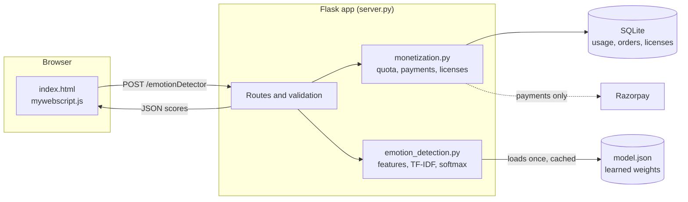

**How the pieces fit**

- `server.py` is a thin web layer. It validates input, applies the plan limits, and calls the detector.
- `emotion_detection.py` holds the feature extractor and the prediction code. It is the only file that understands the model format.
- `monetization.py` is optional. It is switched off automatically on Vercel.
- `train.py` is a separate offline program. It never runs in production. It only produces `model.json`.

### Module dependencies

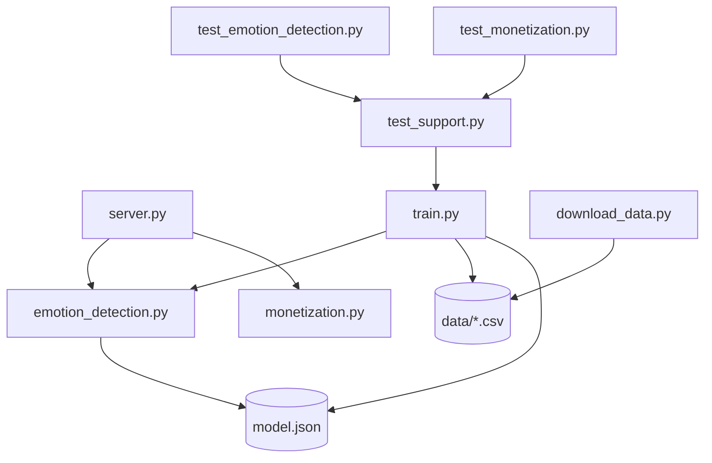

---

## 4. How a request flows through the app

### Sequence

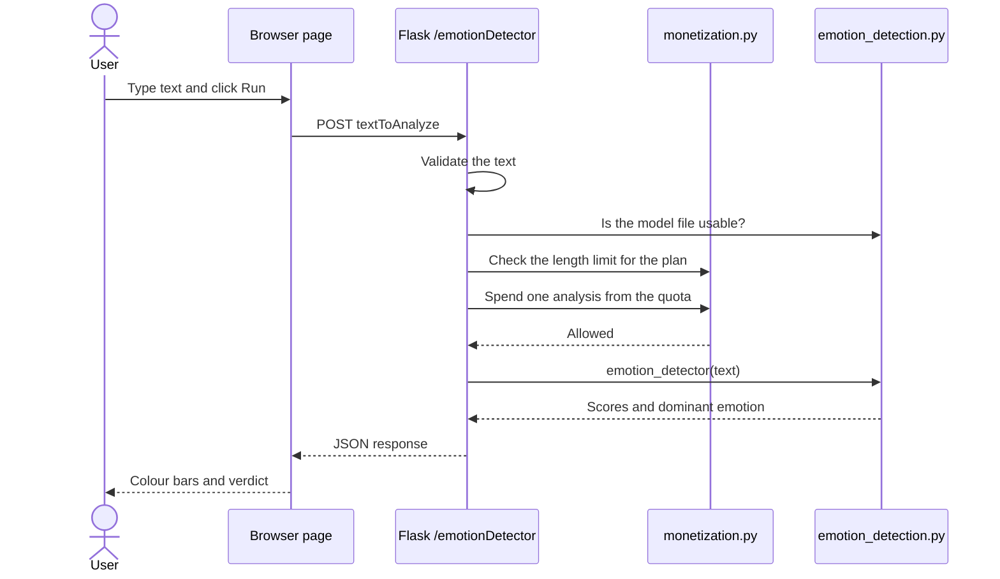

### Decision flow

Every request is checked in this order, and the first failing check decides the response.

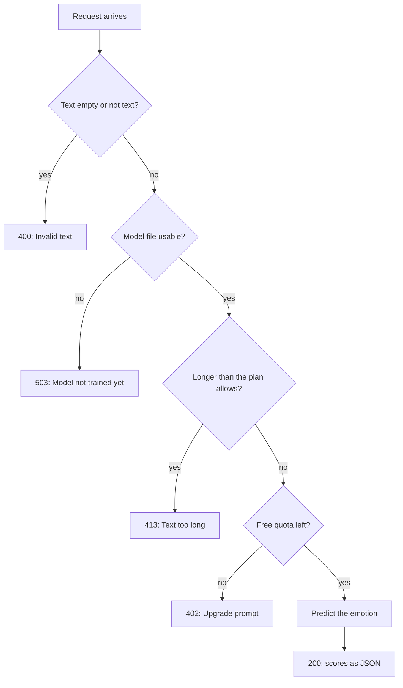

Invalid requests never use up quota, and neither do requests that fail because the model is missing.

### Page states

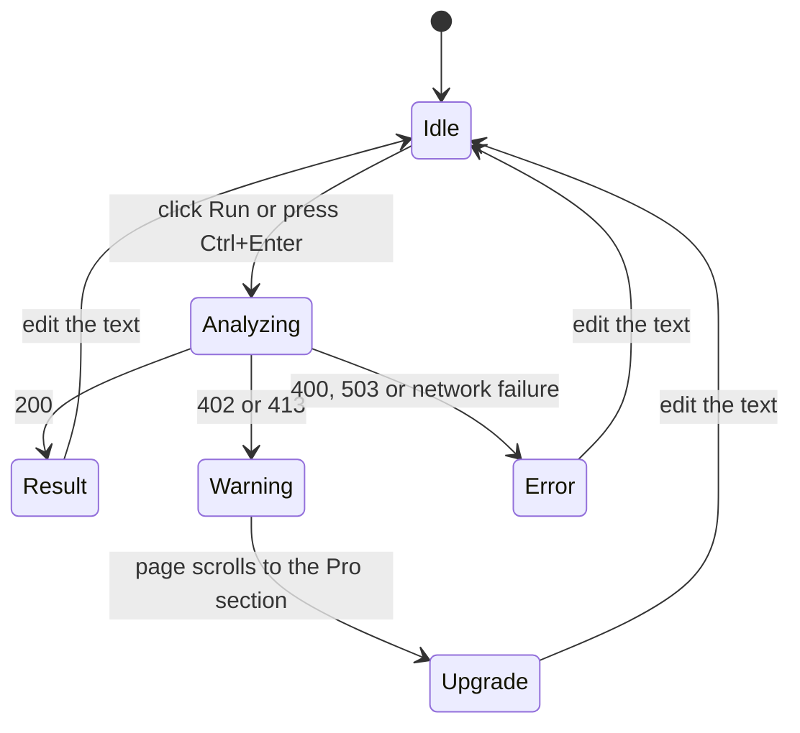

---

## 5. The model, from data to weights

### Training pipeline

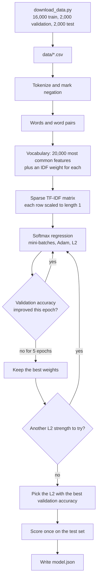

### Feature extraction

Training and prediction call the same function, `extract_features`.

| Step | Example: `I don't feel happy` |
| --- | --- |
| Lowercase, drop apostrophes | `i dont feel happy` |
| Split into words | `i`, `dont`, `feel`, `happy` |
| Mark words after a negator (next 3 words, stopping at "but", "however" and similar) | `i`, `dont`, `not_feel`, `not_happy` |
| Add word pairs | `i_dont`, `dont_not_feel`, `not_feel_not_happy` |

Marking negation lets the model learn that `not_happy` behaves differently from `happy`, even for phrasings it has never seen.

### The math

**Weighting.** For a feature that appears $\text{tf}$ times in a text, out of $N$ training texts of which $\text{df}$ contain it:

$$x_j = \left(1 + \ln \text{tf}_j\right)\cdot \text{idf}_j, \qquad \text{idf}_j = \ln\frac{1+N}{1+\text{df}_j} + 1, \qquad \hat{x} = \frac{x}{\lVert x \rVert_2}$$

**Prediction.** With one weight vector per emotion and a bias $b$:

$$z = W^{\top}\hat{x} + b, \qquad p_k = \frac{e^{z_k}}{\sum_j e^{z_j}}$$

**Loss.** Average cross-entropy over a mini-batch of $B$ texts, plus an L2 penalty:

$$L = -\frac{1}{B}\sum_{i=1}^{B} s_{y_i}\,\ln p_{i,y_i} + \frac{\lambda}{2}\lVert W\rVert^2$$

where $s_{y}$ is an optional class weight. The gradient with respect to the scores is simply $p - y$ (the predicted probabilities minus the one-hot label), which is what `batch_gradient` computes. A test compares it against numerical differentiation.

**Optimiser.** Adam with $\beta_1 = 0.9$, $\beta_2 = 0.999$, a learning rate that starts at 0.1 and shrinks by 5% each epoch, mini-batches of 256, and early stopping after 5 epochs without a better validation accuracy.

### Training settings

| Setting | Default | Flag |
| --- | --- | --- |
| Features kept | 20,000 | `--max-features` |
| Minimum documents per feature | 2 | n/a |
| Epochs (upper limit) | 40 | `--epochs` |
| Learning rate | 0.1 | `--lr` |
| L2 strengths tried | 1e-7, 1e-6, 1e-5 | `--l2` |
| "Neutral" threshold | 0.4 | `--neutral-below` |
| Class weights | none | `--class-weight balanced` |

---

## 6. Prediction in plain Python

At runtime the app never imports NumPy. It reads `model.json` once, keeps it in memory, and predicts with the standard library.

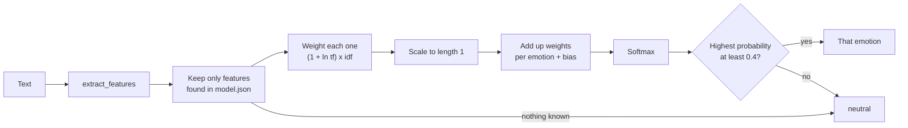

**Neutral cases.** If none of the words are known, or the top probability is below the threshold, the result is `neutral` ("No strong emotion" in the interface). The training data has no neutral class, so this is how the app handles plain factual sentences.

### `model.json` layout

```json
{
  "version": 1,
  "labels": ["sadness", "joy", "love", "anger", "fear", "surprise"],
  "neutral_below": 0.4,
  "bias": [ ... 6 numbers ... ],
  "terms": { "feature": [idf, w_sadness, w_joy, w_love, w_anger, w_fear, w_surprise] },
  "meta": { "train_docs": 16000, "test_accuracy": 0.8475, "vocab_size": 20000 }
}
```

---

## 7. Project structure

```text
emotion-detector/
├── EmotionDetection/            # the "AI" package
│   ├── __init__.py
│   ├── emotion_detection.py     # features, model loading, prediction (standard library only)
│   └── model.json               # learned weights, produced by train.py
│
├── templates/
│   └── index.html               # the page (layout and styles)
├── public/
│   └── mywebscript.js           # the page's behaviour (fetch, render bars, checkout)
│
├── server.py                    # Flask app and routes
├── monetization.py              # free quota, Razorpay payments, license keys
│
├── train.py                     # trains the model from scratch (NumPy)
├── download_data.py             # downloads the dataset into data/
│
├── test_emotion_detection.py    # feature, prediction, gradient and training tests
├── test_monetization.py         # API, quota, payment and demo-mode tests
├── test_support.py              # trains a tiny model on made-up sentences for the tests
│
├── requirements.txt             # runtime: Flask, requests
├── requirements-train.txt       # training only: numpy, datasets
├── .env.example                 # every setting, documented
├── .gitignore
├── LICENSE
└── README.md
```

| Folder | Why it is named that |
| --- | --- |
| `public/` | Vercel serves this folder from its CDN, and Flask's own static folder is not used on Vercel. The app points Flask at `public/` too, so it also works locally. |
| `EmotionDetection/` | Keeps the model and its code together, so `MODEL_PATH` is the only thing you ever need to point somewhere else. |

---

## 8. API reference

| Method | Path | Purpose |
| --- | --- | --- |
| `GET` | `/` | The web page |
| `GET` `POST` | `/emotionDetector` | Analyze a text |
| `GET` | `/api/model` | Facts about the trained model |
| `GET` | `/api/status` | The caller's plan, quota and pricing |
| `POST` | `/api/create-order` | Start a Pro purchase (payments only) |
| `POST` | `/api/verify-payment` | Confirm a payment and issue a license key (payments only) |
| `POST` | `/api/activate` | Unlock Pro with a license key (payments only) |

### `POST /emotionDetector?format=json`

Request:

```json
{ "textToAnalyze": "i feel really bad when my gf scolds me" }
```

Response `200` (values shown are an example):

```json
{
  "dominant_emotion": "sadness",
  "scores": {
    "sadness": 0.91, "joy": 0.03, "love": 0.0,
    "anger": 0.05, "fear": 0.01, "surprise": 0.0
  },
  "status": { "tier": "demo", "daily_limit": null, "remaining": null, "max_chars": 5000, "expires_at": null }
}
```

The text can also come from the query string (`?textToAnalyze=...`) or a form. Without `format=json`, the endpoint returns a short text sentence with the scores and the dominant emotion in bold.

| Status | Meaning |
| --- | --- |
| `200` | Success |
| `400` | Empty or invalid text |
| `402` | Free quota used up (quotas on only) |
| `413` | Text longer than the limit (500 characters on the free plan, 5,000 on Pro and in demo mode) |
| `503` | `model.json` is missing or unreadable |

### `GET /api/model`

```json
{
  "labels": ["sadness", "joy", "love", "anger", "fear", "surprise"],
  "train_docs": 16000, "test_docs": 2000, "test_accuracy": 0.8475,
  "test_macro_f1": 0.78, "vocab_size": 20000
}
```

The page uses this to show the accuracy note under the result.

---

## 9. Interface design

**Goals:** one job (paste text, see the emotion), no clutter, and honest about what the model is.

### Layout

```text
┌──────────────────────────────────────────────┐
│  NLP - Emotion Detection                     │  title (Bricolage Grotesque)
│  One-paragraph description                   │
│                                              │
│  ┌────────────────────────────────────────┐  │
│  │ Please enter the text to be analyzed   │  │
│  │ ┌────────────────────────────────────┐ │  │
│  │ │ text area                          │ │  │
│  │ └────────────────────────────────────┘ │  │
│  │ Try an example: (Joyful) (Angry) ...   │  │  one-click examples
│  │ [ Run Sentiment Analysis ]     48/500  │  │  character counter
│  │ 9 of 10 free analyses left today       │  │  quota (hidden in demo mode)
│  └────────────────────────────────────────┘  │
│                                              │
│  Result of Emotion Detection                 │
│  Joy                                         │  large word in the emotion's colour
│  Sadness  ███░░░░░░░░░░░░░░░░░░░░   12%      │
│  Joy      ████████████████████░░░   79%      │  six bars, dominant one in bold
│  ...                                         │
│  Trained from scratch on 16,000 texts...     │  real accuracy note
│                                              │
│  ────────────────────────────────────────    │
│  Go Pro (only when payments are on)          │
└──────────────────────────────────────────────┘
```

### Design tokens

| Token | Value | Use |
| --- | --- | --- |
| Ink | `#172033` | Text, primary button |
| Muted | `#5b6577` | Secondary text |
| Line | `#dde1e8` | Borders |
| Page | `#f4f5f7` | Background |
| Sadness | `#3a78d0` | Blue |
| Joy | `#d99a10` | Amber |
| Love | `#d2497f` | Pink |
| Anger | `#cc433b` | Red |
| Fear | `#7657c2` | Purple |
| Surprise | `#1f9c8c` | Teal |

**Type:** Bricolage Grotesque for the title and the result word, DM Sans for everything else, each with a system-font fallback.

**Layout:** a single 680 px column, left aligned, reflowing below 520 px.

**Accessibility:** visible keyboard focus, a live region that announces results, `prefers-reduced-motion` respected (the bars stop animating), no colour-only meaning (each bar is labelled with its name and percentage).

**Safety:** results are built with DOM nodes and `textContent`, never `innerHTML`, so nothing the server or a user sends can inject markup.

---

## 10. Monetization architecture

An optional layer. It is **off automatically on Vercel** (there is no persistent disk for its database) and **on** when you run on a normal server.

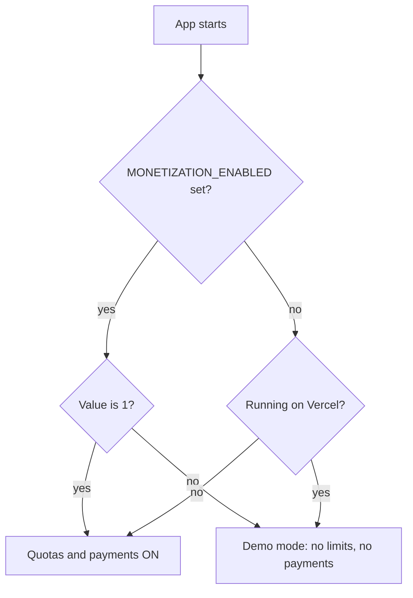

### Plans

| | Free | Pro pass |
| --- | --- | --- |
| Analyses | 10 per day | Unlimited |
| Text length | 500 characters | 5,000 characters |
| Price | free | 149 INR for 30 days (one-time) |
| Reset | Local midnight (IST by default) | n/a |

All numbers are settings (see [Configuration](#13-configuration)).

### Payment flow (Razorpay Checkout)

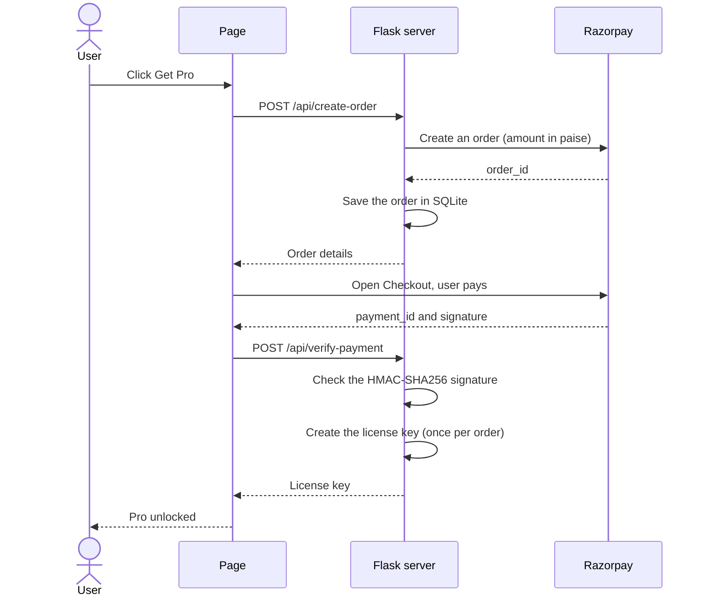

**Safety details**

- The price is set on the server when the order is created, so the browser cannot change it.
- The payment signature is verified with a constant-time comparison.
- A payment for an unknown order is rejected, and replaying a verification returns the same key instead of creating a second one.
- License keys have an expiry that is enforced on the server. Keys look like `EMO-XXXX-XXXX-XXXX-XXXX` and use an alphabet without look-alike characters.
- Free usage is counted per browser cookie and per IP address (the IP limit is five times higher, so shared networks are not punished).

### Database

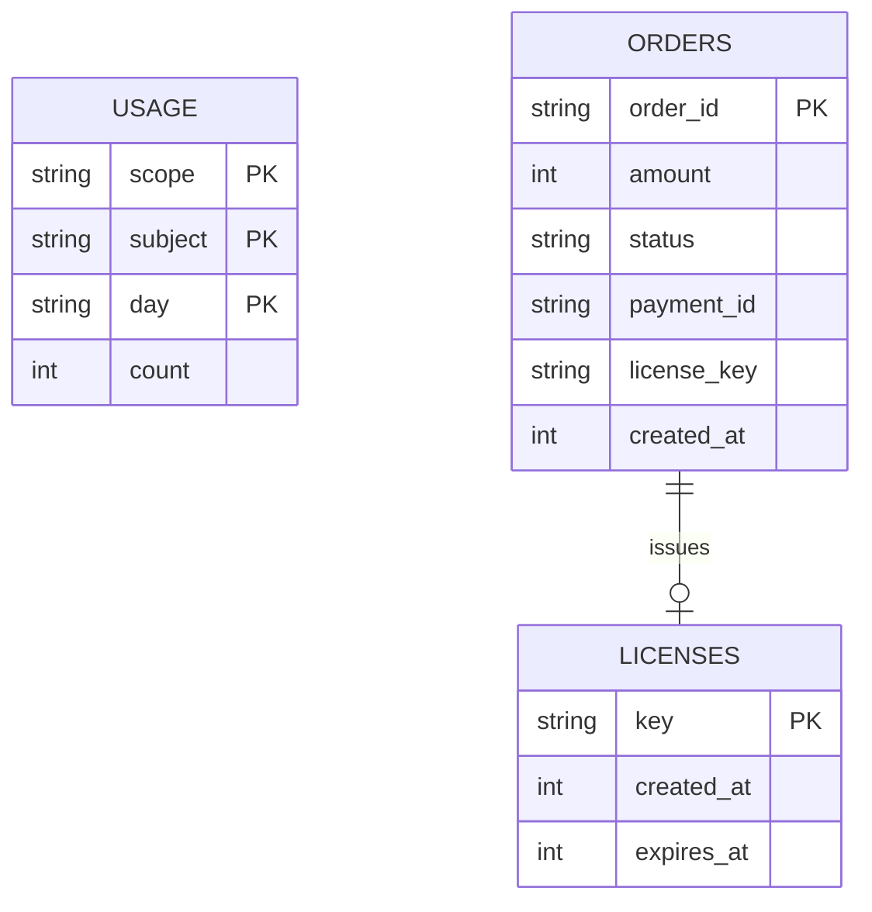

---

## 11. Getting started

**Requirements:** Python 3.10 or newer.

### Train the model (once)

```bash
pip install -r requirements-train.txt
python download_data.py        # saves data/train.csv, validation.csv, test.csv
python train.py                # writes EmotionDetection/model.json
```

`train.py` prints the validation results while it trains and then a full report on the test set: accuracy, macro F1, per-emotion precision and recall, and the confusion matrix.

If `datasets` cannot be installed, download the `dair-ai/emotion` splits yourself and save them as `data/train.csv`, `data/validation.csv` and `data/test.csv` with the columns `text,label` (label as a word such as `joy`).

### Run the app

```bash
pip install -r requirements.txt
python server.py               # http://localhost:5000
```

### Try the API

```bash
curl -X POST "http://localhost:5000/emotionDetector?format=json" \
     -H "Content-Type: application/json" \
     -d '{"textToAnalyze": "i feel so nervous about tomorrow"}'
```

---

## 12. Deployment

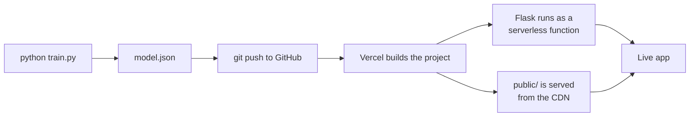

1. Train the model and commit `EmotionDetection/model.json` (about 1 MB). Do **not** commit `data/`.
2. Push the project to GitHub.
3. In Vercel, click Add New, then Project, import the repository, and click Deploy. Vercel finds `server.py` and `requirements.txt` on its own, so no configuration file is needed.
4. The app runs in demo mode: no limits, no payments.

**Running with payments** needs a server with a persistent disk (for the SQLite file) and a production server, for example:

```bash
gunicorn -w 2 server:app
```

---

## 13. Configuration

Copy `.env.example` to `.env` and set what you need. Every setting has a default.

| Variable | Default | Purpose |
| --- | --- | --- |
| `MODEL_PATH` | `EmotionDetection/model.json` | Use a model file from somewhere else |
| `MONETIZATION_ENABLED` | on, except on Vercel | Force quotas and payments on (`1`) or off (`0`) |
| `SECRET_KEY` | random per start | Signs the visitor cookie. Set it in production |
| `RAZORPAY_KEY_ID`, `RAZORPAY_KEY_SECRET` | none | Enable payments. Use test keys first |
| `FREE_DAILY_LIMIT` | `10` | Free analyses per day |
| `FREE_MAX_CHARS` | `500` | Free text length limit |
| `PRO_MAX_CHARS` | `5000` | Pro text length limit |
| `PRO_PRICE_INR` | `149` | Pro pass price |
| `PRO_DAYS` | `30` | Length of a pass |
| `FREE_IP_MULTIPLIER` | `5` | IP limit as a multiple of the per-browser limit |
| `USAGE_TZ_OFFSET_MINUTES` | `330` | When the daily quota resets (330 is IST) |
| `DATABASE_PATH` | `emotion_detector.db` | SQLite file location |
| `TRUST_PROXY` | `0` | Set to `1` behind a reverse proxy so IPs are read correctly |
| `SESSION_COOKIE_SECURE` | `0` | Set to `1` once the site is served over HTTPS |

---

## 14. Testing

```bash
python -m unittest
```

The tests train a tiny model on made-up sentences, so they run in about a second and need no dataset. They check that the code works. Real accuracy comes from `train.py` on the real data.

| Area | What is checked |
| --- | --- |
| Features | Lowercasing, apostrophes, negation marking, word pairs |
| Prediction | Each emotion is recognised, probabilities add up to 1, empty input, unknown words, low confidence gives "neutral" |
| Model file | A missing or corrupt `model.json` gives a clear error instead of a crash |
| Training | The model learns held-out data, and rejects labels it has never seen |
| Correctness | **NumPy training maths and plain-Python prediction agree**, and **the gradient matches numerical differentiation** |
| API | Response shapes, error codes, model info endpoint, original text response |
| Quota | Free limit and upgrade prompt, invalid requests do not use quota, clearing cookies does not reset the limit for good |
| Payments | Purchase unlocks Pro, bad signatures and unknown orders are rejected, replays are safe, keys work on another browser, expiry, Razorpay failures |
| Demo mode | No limits and no database access on Vercel, payment routes switched off |

---

## 15. Design decisions

| Decision | Why |
| --- | --- |
| **Train from scratch** | To understand every step: features, loss, gradients, optimisation, evaluation. There is no black box. |
| **Linear model on TF-IDF** | It is fast, small, easy to inspect and gives good accuracy for its size. A transformer would score higher but is far heavier and would hide the learning. |
| **NumPy to train, plain Python to serve** | Training needs fast array maths. Serving one text does not, and skipping NumPy keeps deployment tiny and cold starts quick. |
| **JSON model file** | Human-readable, diff-friendly, and loadable anywhere. It is a sparse dictionary, so unseen words cost nothing. |
| **One shared feature extractor** | Training and serving cannot disagree about how text becomes numbers, and a test enforces it. |
| **Validation set for tuning, test set once** | Keeps the reported accuracy honest. |
| **"Neutral" instead of forcing an answer** | A classifier always picks something. A confidence threshold makes the app admit when it does not know. |
| **Monetization switches off on Vercel** | Vercel has no persistent disk, so the database cannot live there. The demo stays free and simple. |
| **SQLite for the business layer** | No extra service to run, and enough for licenses and counters. |

---

## 16. Limitations and roadmap

**Limitations**

- The model learned from tweets that describe feelings ("i feel ..."), so it works best on first-person sentences about emotion. Formal text, sarcasm and long documents are harder.
- There is no "neutral" or "disgust" class in the data, so those cannot be predicted directly.
- Surprise and love have the fewest examples and the lowest scores.
- English only. Bag-of-words features cannot capture long-range meaning or word order beyond word pairs.
- On Vercel the free-quota and payment features are off.

**Roadmap**

- Try `--class-weight balanced` and report the trade-off for surprise and love.
- Add a "why this result" view that shows the words that pushed the score the most.
- Train on a larger, more varied dataset, and add a disgust class.
- Replace the bag-of-words features with small learned word embeddings, still from scratch.
- Razorpay webhook so a payment is never lost if the browser closes early.

---

## 17. Author

**Shivansh Kumar**

- Portfolio: [shivanshonline.in](https://shivanshonline.in)
- GitHub: [@shivansh07adi-cloud](https://github.com/shivansh07adi-cloud)

Designed, trained, built and deployed by me, from the learning algorithm to the web page.

---

## 18. Acknowledgements

- **Data:** the [`dair-ai/emotion`](https://huggingface.co/datasets/dair-ai/emotion) dataset of English tweets, from the paper *CARER: Contextualized Affect Representations for Emotion Recognition* (Saravia, Liu, Huang, Wu and Chen, EMNLP 2018).
- **Tools:** Flask, NumPy, Bootstrap 4 (base styles), Razorpay Checkout and Vercel.

---

## 19. License

Released under the Apache License 2.0. See [LICENSE](LICENSE).
